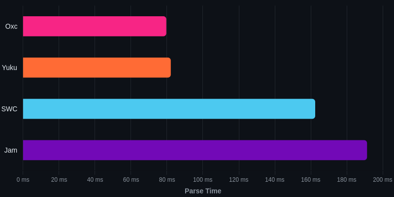
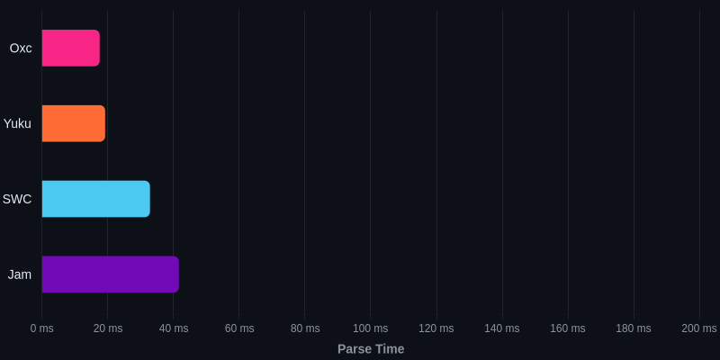
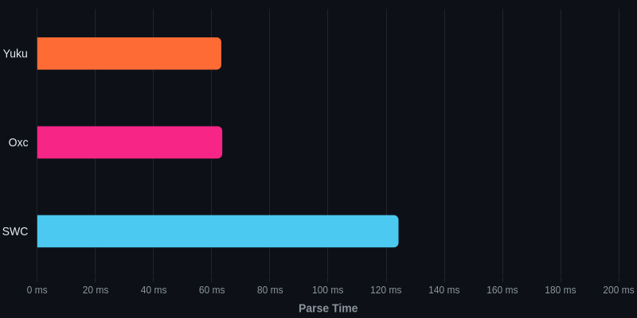

# ECMAScript Native Parser Benchmark

Benchmark ECMAScript parsers implemented in native languages.

## System

| Property | Value |
|----------|-------|
| OS | Linux 6.11.0-1018-azure (x64) |
| CPU | Intel(R) Xeon(R) Platinum 8370C CPU @ 2.80GHz |
| Cores | 4 |
| Memory | 16 GB |

## Parsers

### [Yuku](https://github.com/arshad-yaseen/yuku)

**Language:** Zig

A high-performance & spec-compliant JavaScript/TypeScript compiler written in Zig.

### [Oxc](https://github.com/oxc-project/oxc)

**Language:** Rust

A high-performance JavaScript and TypeScript parser written in Rust.

### [SWC](https://github.com/swc-project/swc)

**Language:** Rust

An extensible Rust-based platform for compiling and bundling JavaScript and TypeScript.

### [Jam](https://github.com/srijan-paul/jam)

**Language:** Zig

A JavaScript toolchain written in Zig featuring a parser, linter, formatter, printer, and vulnerability scanner.

## Benchmarks

### [TypeScript](https://github.com/arshad-yaseen/ecmascript-native-parser-benchmark/blob/main/files/typescript.js)

The TypeScript compiler source code bundled into a single file.

**File size:** 7.83 MB



| Parser | Mean | Min | Max |
|--------|------|-----|-----|
| Oxc | 70.31 ms | 69.57 ms | 75.63 ms |
| Yuku | 71.29 ms | 70.81 ms | 74.28 ms |
| SWC | 142.37 ms | 141.51 ms | 143.33 ms |
| Jam | 162.54 ms | 159.70 ms | 165.51 ms |

### [Three.js](https://github.com/arshad-yaseen/ecmascript-native-parser-benchmark/blob/main/files/three.js)

A popular 3D graphics library for the web.

**File size:** 1.96 MB



| Parser | Mean | Min | Max |
|--------|------|-----|-----|
| Oxc | 15.79 ms | 15.14 ms | 22.95 ms |
| Yuku | 17.21 ms | 16.65 ms | 27.18 ms |
| SWC | 30.63 ms | 29.90 ms | 48.06 ms |
| Jam | 37.00 ms | 36.15 ms | 44.82 ms |

### [Ant Design](https://github.com/arshad-yaseen/ecmascript-native-parser-benchmark/blob/main/files/antd.js)

A popular React UI component library with enterprise-class design.

**File size:** 5.43 MB



| Parser | Mean | Min | Max |
|--------|------|-----|-----|
| Yuku | 54.75 ms | 54.39 ms | 56.67 ms |
| Oxc | 55.67 ms | 55.12 ms | 63.46 ms |
| SWC | 108.83 ms | 107.86 ms | 110.17 ms |
| Jam | Failed to parse | - | - |

## Run Benchmarks

### Prerequisites

- [Bun](https://bun.sh/) - JavaScript runtime and package manager
- [Rust](https://www.rust-lang.org/tools/install) - For building Rust-based parsers
- [Zig](https://ziglang.org/download/) - For building Zig-based parsers (requires nightly/development version)
- [Hyperfine](https://github.com/sharkdp/hyperfine) - Command-line benchmarking tool

### Steps

1. Clone the repository:

```bash
git clone https://github.com/arshad-yaseen/ecmascript-native-parser-benchmark.git
cd ecmascript-native-parser-benchmark
```

2. Install dependencies:

```bash
bun install
```

3. Run benchmarks:

```bash
bun bench
```

This will build all parsers and run benchmarks on all test files. Results are saved to the `result/` directory.

## Methodology

### How Benchmarks Are Conducted

1. **Build Phase**: All parsers are compiled with release optimizations:
   - Rust parsers: `cargo build --release` with LTO, single codegen unit, and symbol stripping
   - Zig parsers: `zig build --release=fast`

2. **Benchmark Phase**: Each parser is benchmarked using [Hyperfine](https://github.com/sharkdp/hyperfine):
   - 100 warmup runs to ensure stable measurements
   - Multiple timed runs for statistical accuracy
   - Results exported to JSON for analysis

3. **Measurement**: Each benchmark measures the total time to:
   - Read the source file from disk
   - Parse the entire file into an AST
   - Clean up allocated memory

### Test Files

The benchmark uses real-world JavaScript files from popular open-source projects to ensure results reflect practical performance characteristics.